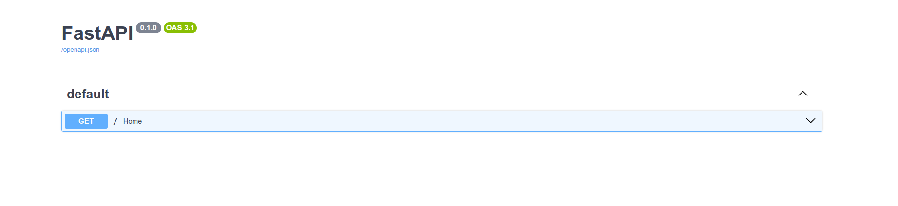
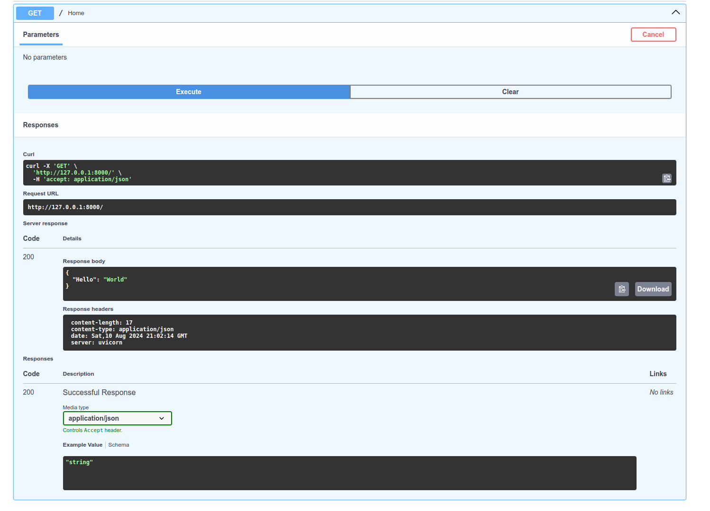
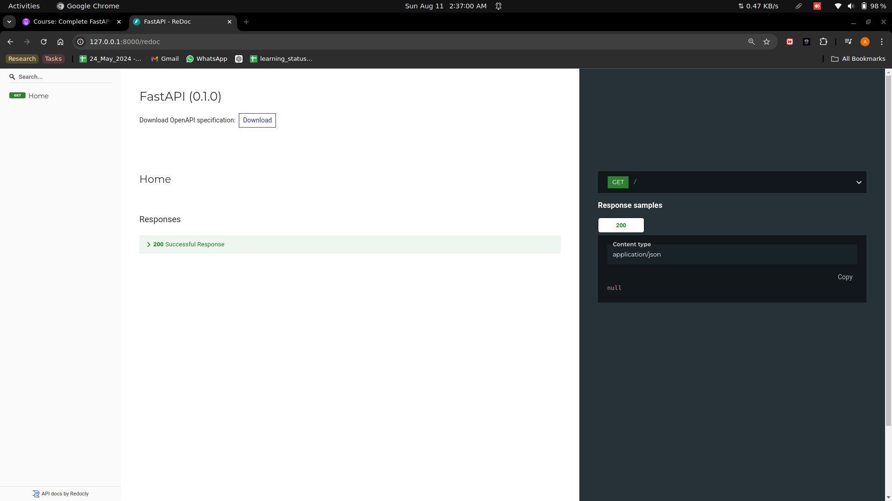
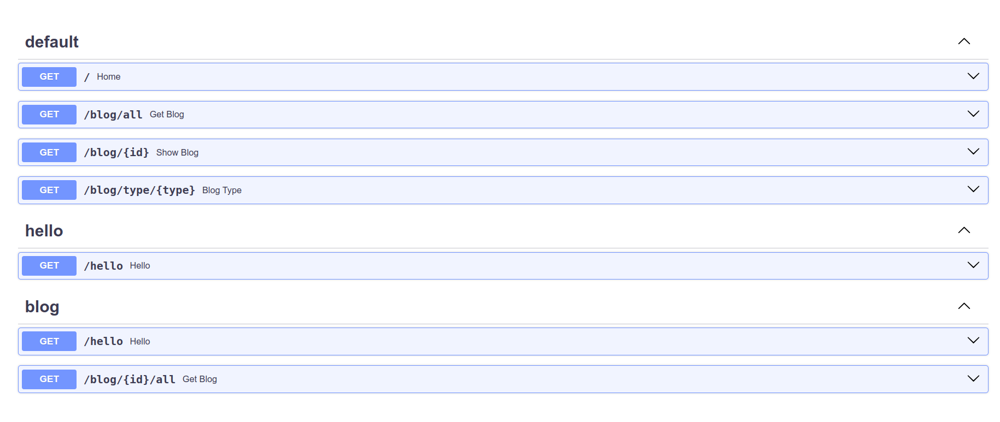
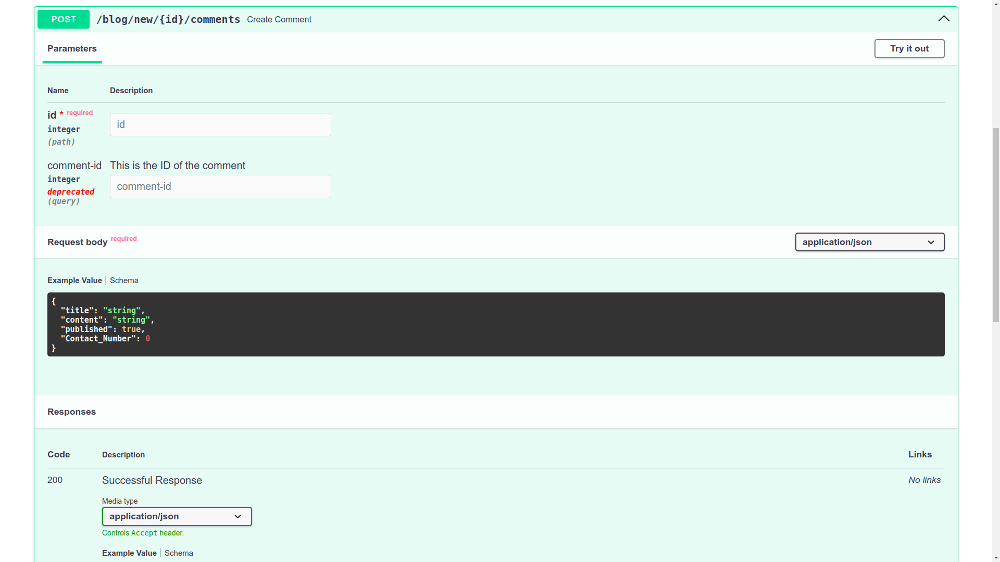
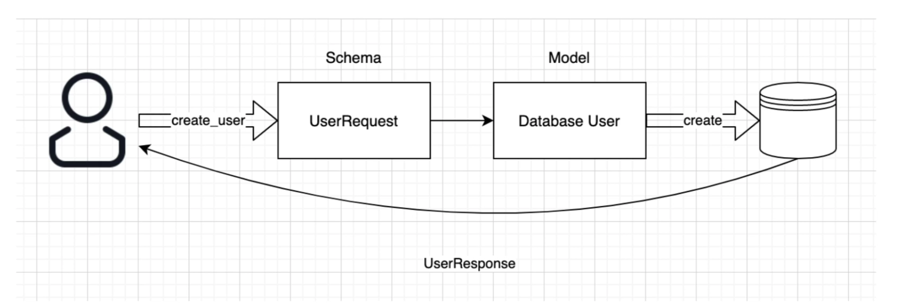
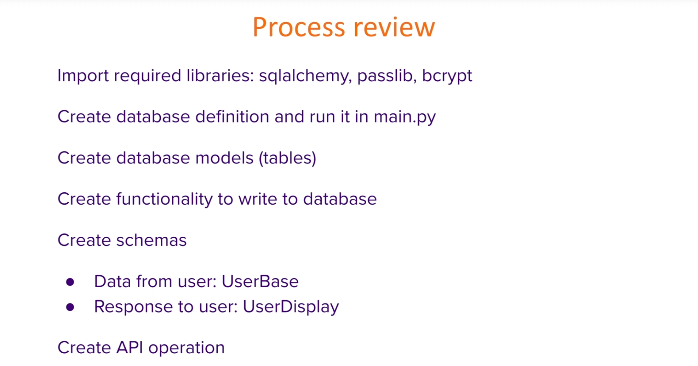
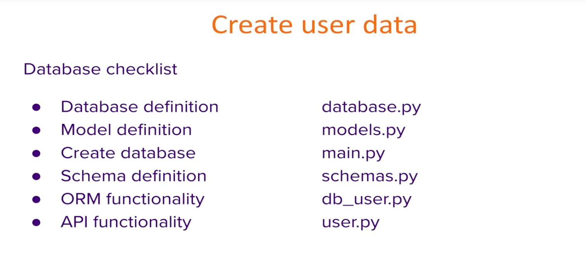
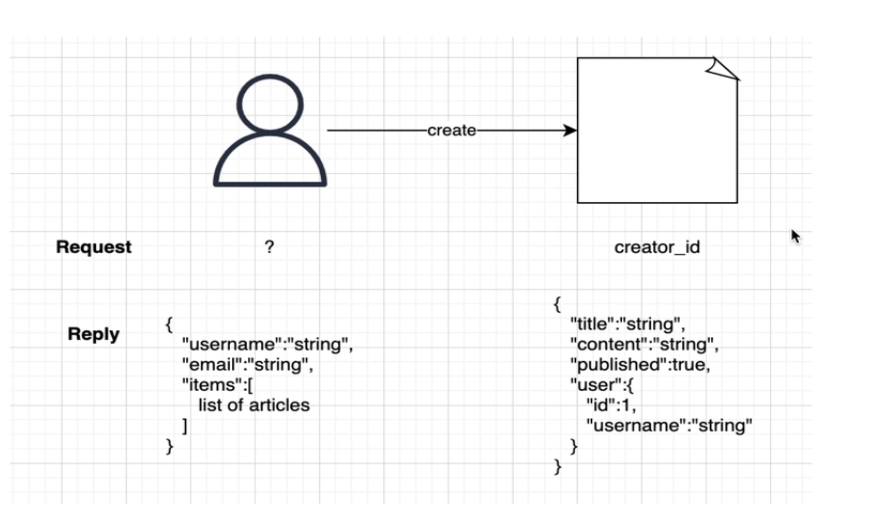
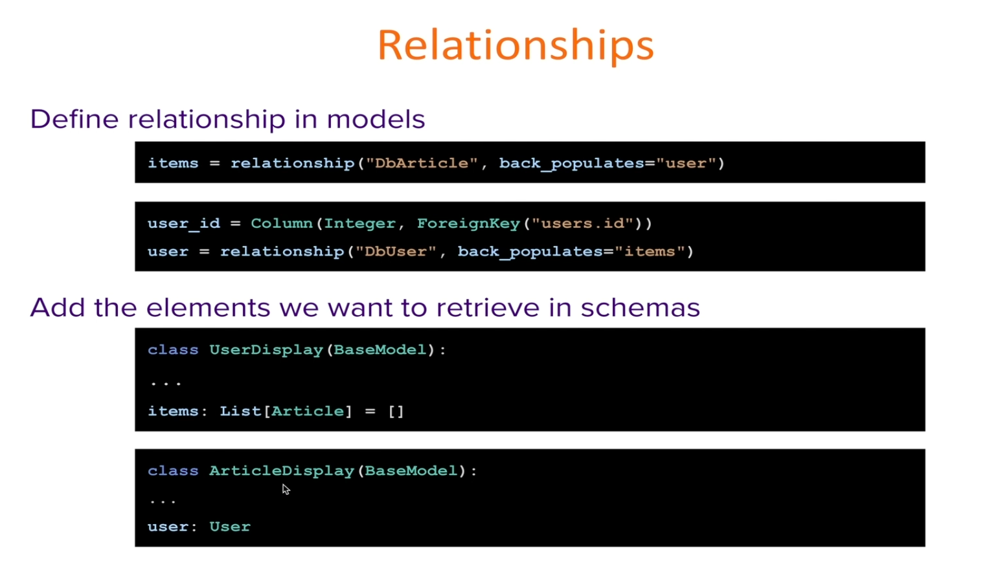

## Fast API
Fastest growing API developement framework
- Easy to use
- Fast
- Lightwight

## Features

 * **Swagger Documentation is automatically generated**

``` python
from fastapi import FastAPI

app = FastAPI()

@app.get("/")
def home():
    return {"Hello": "World"} 
```

### Swagger UI

http://127.0.0.1:8000/docs#/ - Docs Url

returns





### Redoc UI

http://127.0.0.1:8000/redoc 



* ### It uses std. Python 3
* ### Security and Authentication is integrated
* ### Dependency Injection
* ### Testing - 100% Coverage

## Get Methord
* Path Parameters
* Predefined Values
* Query Parameters

### Path Parameters :
Variable that we provide inside our path.

``` Python
@app.get("/blog/{id}")
def show_blog(id):
    return {"data": f'Blog id is {id}'}
```
### Type Validation : 
it uses `Pydantic`
``` python
@app.get("/blog/{id}")
def show_blog(id: int):
    return {"data": f'Blog id is {id}'}
```
* Order is ismportant

  - all the paths are executed one by one sequencially from top to bottom

### Predefined Path :
* we Use **enum**

``` python 
class BlogType(str,enum):
    short = 'short'
    medium = 'medium'
    large = 'large'
```
``` python
@app.get('/blog/type/{type}')
def blog_type(type: BlogType):
    return {"message" : f"Blog type : {type}"}
```
### Query Parameters :
**Parameters that we pass after path**
* Any function parameters that are not the part of the path
* Seperated by ? from path and & is used to seperate 2 query parameters

```python
@app.get('/blog/all')
def get_blog(page,pagesize):
    return {"page": page, "pagesize": pagesize}
```
**Default Values**
```python
@app.get('/blog/all')
def get_blog(page=1,pagesize=10):
    return {"page": page, "pagesize": pagesize}
```
When we add default Values it behaves like optional field just because it is prefilled.

### Optional parameters
```python
@app.get('/blog/all')
def get_blog(page=1,pagesize: Optional[int]=None):
    return {"page": page, "pagesize": pagesize}
```
#### Query and path parameters
```python
@app.get('/blog/{id}/all')
def get_blog(id,page=1,pagesize: Optional[int]=None):
    return {"id": id ,"page": page, "pagesize": pagesize}
```
## Operation Description
* Status code
* Tags
* Summary and Description
* Responce Description

### Status Code :
Indicate the outcome of an operation

- Frontend heavily relay on Status Code

**Change the status code**

`from fastapi import status`
```python
@app.get("/blog/{id}",status_code=404)
def show_blog(id: int):
    if id > 10:
        return {'error':f'Blog {id} not found'}
    else:
        return {"data": f'Blog id is {id}'}
```
**Change the status code on response**

`from fastapi import Response`
```python
@app.get("/blog/{id}",status_code=status.HTTP_200_OK)
def show_blog(id: int,response: Response):
    if id > 10:
        response.status_code = status.HTTP_404_NOT_FOUND
        return {'error':f'Blog {id} not found'}
    else:
        response.status_code = status.HTTP_200_OK
        return {"data": f'Blog id is {id}'}
```
### Tags :
- Categorize Operations
- Multipe Categories
```python
@app.get('/blog/{id}/comment/{comment_id}',tags=['blogs','comment'])
```


### Summary and Description :
provides information about operation

- **Sumary** : Few words or a sentence
- **Description** : usually In detail Information

```python 
@app.get(
        '/blog/{id}/all',
        tags=["blog"],
        summary="Get all blogs",
        description="Get all blogs In detail",
        )
def get_blog(id,page=1,pagesize: Optional[int]=None):
    return {"id": id ,"page": page, "pagesize": pagesize}
```

`Description is also taken from the docstring`

```python
@app.get("/hello",tags=["hello","blog"])
def hello():
    """
    This is a test function
    """
    return ("Hello World!")
```


### Responce Description :
Provides information about the output
```python
@app.get(
        '/blog/{id}/all',
        tags=["blog"],
        summary="Get all blogs",
        description="Get all blogs In detail",
        response_description="List of all blogs"
        )
def get_blog(id,page=1,pagesize: Optional[int]=None):
    return {"id": id ,"page": page, "pagesize": pagesize}
```
## Routers
Allows us to split our application and operations that we have on our api into multiple files and multiple components.
- Seperate operations into multiple files
- Share a prefix between multiple operations
- Share tags

`create a file blog_get.py inside a folder routers`
```python
from fastapi import APIRouter

router = APIRouter(
    prefix="/blog",
    tags=["blog"],
)
```
it is similar to app
- `app is replaced by router`
```python
@router.get("/{id}")
def show_blog(id: int):
    return {"data": f'Blog id is {id}'}

class BlogType(str,Enum):
    short = 'short'
    medium = 'medium'
    large = 'large'

@router.get('/type/{type}')
def blog_type(type: BlogType):
    return {"message" : f"Blog type : {type}"}
```
in `main.py` add 

```python
from routers import blog_get
app.include_router(blog_get.router)
```
## Parameters
- ### Request Body
  - Post method
  - Pydantic BaseModel is used 
  - Read request body as JSON
  - **Data Validation** : fastAPI make sure that the data we receive is the type that we are expecting
  - Data Conversion
  - JSON Schema: We get JSON as an output
  ```Python
  class BlogModel(BaseModel):
    title : str
    content : str
    published : Optional[bool]
  ```
  FastAPI will convert the Data

  ```python
  @routers.post('/new')
  def create_blog(blog:BlogModel):
    return blog
  ```
  ```python 
  # import base model
  from pydantic import BaseModel
  # create a model
  class BlogModel(BaseModel):
    title: str
    content: str
    published: Optional[bool]
  # use the model that we created earlier
  @router.post('/new')
  def create_blog(blog: BlogModel):
    return {"data": blog}
  ```
### Path and Quiry Parameter
```python
@router.post('/new/{id}')
def create_blog(blog: BlogModel,id: int,version: int = 1):
    return {
        "id": id,
        "version": version,
        "data": blog
        }
```
### Parameter Metadata
- Information displayed in docs
- using the quiry path and body imports
- set default value

**Add title and Description:**
```python

@router.post('/new/{id}/comments')
def create_comment(blog:BlogModel,id:int,
                comment_id: int= Query(None,
                title="Comment ID",
                description="This is the ID of the comment",
                )
            ):
    return {"id":id,
            "comment_id":comment_id,
            "data":blog
            }
```

**Add Alias:**
```python
@router.post('/new/{id}/comments')
def create_comment(blog:BlogModel,id:int,
                comment_id: int= Query(None,
                title="Comment ID",
                description="This is the ID of the comment",
                alias="comment-id", # Alias is added here
                )
            ):
    return {"id":id,
            "comment_id":comment_id,
            "data":blog
            }
```
**Add Deprication**
```python
@router.post('/new/{id}/comments')
def create_comment(blog:BlogModel,id:int,
                comment_id: int= Query(None,
                title="Comment ID",
                description="This is the ID of the comment",
                alias="comment-id",
                deprecated=True, # Deprication added here
                )
            ):
    return {"id":id,
            "comment_id":comment_id,
            "data":blog
            }
```


## Validators
Validates data passed to parameters

- Provide a default Value
    ```python
    @router.post('/new/{id}/comments')
    def create_comment(blog:BlogModel,id:int,
                    comment_id: int= Query(None,
                    title="Comment ID",
                    description="This is the ID of the comment",
                    alias="comment-id",
                    deprecated=True,
                    ),
                    content : str = Body("Hii, How are you?") # Provide a default value
                ):
        return {"id":id,
                "comment_id":comment_id,
                "data":blog,
                "content":content
                }
    ```
- Require a Value (Non-Optional parameter)

    ```python
    content : str = Body(...)
    ```
    Or
    ```python
    content : str = Body(Ellipsis)
    ```
    `...` Is called as Elepsis in python
- Require Min/Max Length
    ```Python
    content : str = Body(...,
                max_length=100,
                min_length = 10
                )
    ```
- Regex Validation
    ```python
    content : str = Body(...,
                max_length=100,
                min_length = 10,
                regex = "regex"
                )
    ```
## Multiple Values 
- Only Available for Quiry Parameters

`'http://127.0.0.1:8000/blog/new/8/comments?comment-id=9&version=string1&version=string2&version=string3'`

- we need to define an optional quiry parameter

```python
version: Optional[List[str]]  = Query(None),
```
then return 

```python
"version":version
```
- We can provide default values

```python
 version: Optional[List[str]]  = Query([1,2,3])
```
## Number Validators
**Grater than:**
```py
comment_id: int = Path(...,gt=5)
```

**Grater than or equal to**
```py
comment_id: int = Path(...,ge=5)
 ```
**Less than**
```py
comment_id: int = Path(...,lt=5)
 ```
**Less than or equal to**
```py
comment_id: int = Path(...,le=5)
 ```

## Complex Subtypes
`tags : List[str] = []` in
```py
class BlogModel(BaseModel):
    title: str
    content: str
    published: Optional[bool]
    Contact_Number: Optional[int]
    tags : List[str] = []
```
- We can use list,set,dict and tuples

    `metadata : dict[str,str] = {'author':'Author Name'}`

- **Custom model subtype**
```py
class Image(BaseModel):
    url: str
    name: str

class BlogModel(BaseModel):
    title: str
    content: str
    published: Optional[bool]
    Contact_Number: Optional[int]
    tags : List[str] = []
    metadata : dict[str,str] = {'author':'Author Name'} 
    image: Optional[Image] = None
```

**Dependencies :** 
- Allow a func to depend on another func.
- Allows us to implement functionality seamlessly

**1. create a function**
```py
def required_functionality():
    return "This is the required functionality"
```
**2. Call anywhere we want**

`add req_parameter:str=Depends(required_functionality)`
```py
def get_blog(id,page=1,pagesize: Optional[int]=None,req_parameter:str=Depends(required_functionality)):
    return {"id": id ,"page": page, "pagesize": pagesize}
```
`from routers.blog_post import required_functionality`

`from fastapi import Depends`

# Database 
- Any relational databse 
- **ORM**(Object Relation Model) Library
- SQLAlchemy




1. Create a folder(db) in root directry
2. Create a file(databse.py) inside db 
3. Paste the Boilerplate code
    ```py
    from sqlalchemy import create_engine
    from sqlalchemy.ext.declarative import declarative_base
    from sqlalchemy.orm import sessionmaker
    
    SQLALCHEMY_DATABASE_URL = "sqlite:///./fastapi-practice.db"
    
    engine = create_engine(
        SQLALCHEMY_DATABASE_URL, connect_args={"check_same_thread": False}
    )
    SessionLocal = sessionmaker(autocommit=False, autoflush=False, bind=engine)
    
    Base = declarative_base()
    ```
4. create a func inside `database.py`
    ```py
    def get_db():
        db = SessionLocal()
        try:
            yield db
        finally:
            db.close()
    ```
5. create a file(`models.py`) inside `db folder`
    ```py
    from sqlalchemy import Boolean, Column, Integer, String
    from sqlalchemy.orm import relationship  # Add this line
    from db.databse import Base


    class DbUser(Base):
        __tablename__ = "users"
        id = Column(Integer, primary_key=True, index=True)
        email = Column(String, unique=True, index=True)
        hashed_password = Column(String)
        is_active = Column(Boolean, default=True)
        items = relationship("DbItem", back_populates="owner")
    ```
6. go to `main.py` and add

    ```py
    models.Base.metadata.create_all(bind=engine)
    ```
Now our Database is created as fastapi-practice.db

`we can install tableplus to view data`

**Create User Data**


Create a file(`schemas.py`) in main diractory
```py
from pydantic import BaseModel

class UserBase(BaseModel):
    name: str
    email: str
    age: int
    password: str
```
Create a file(`db_user.py`) inside db folder
```py
from sqlalchemy.orm import Session
from db.models import DbUser
from schemas import UserBase

def create_user(db: Session, request: UserBase):
    new_user = DbUser(
        username = request.username,
        email = request.email,
        password = request.password
    )
```
create a file(`hash.py`) inside db folder
```py
from passlib.context import CryptContext

pwd_context = CryptContext(schemes=["bcrypt"], deprecated="auto")

class Hash:
    def bcrypt(password: str):
        return pwd_context.hash(password)

    def verify(hashed_password, plain_password):
        return pwd_context.verify(plain_password, hashed_password)
```
Now go to `db_user` and add :
```py
def create_user(db: Session, request: UserBase):
    new_user = DbUser(
        username = request.username,
        email = request.email,
        password = Hash(request.password)
    )
    db.add(new_user)
    db.commit()
    db.refresh(new_user)

    return new_user
```
Create a file(`user.py`) inside routers folder


---------------------------------------------------------------------
----
---

## Relationships

- Allow us to retrive elements from multiple tables in a single request
- Combine multiple request from multiple information sources into a single output show that one request that we send will use multiple levels of information


**Define Relationships in model:**
In `models.py` add

```py
class Dbarticle(Base):
    __tablename__ = "articles"
    id = Column(Integer, primary_key=True, index=True)
    title = Column(String, index=True)
    content = Column(String, index=True)
    published = Column(Boolean, default=True)
    user_id = Column(Integer, ForeignKey("users.id"))
    user = relationship("DbUser", back_populates="")
```

**Add the elements we want to retrive in schemas**



